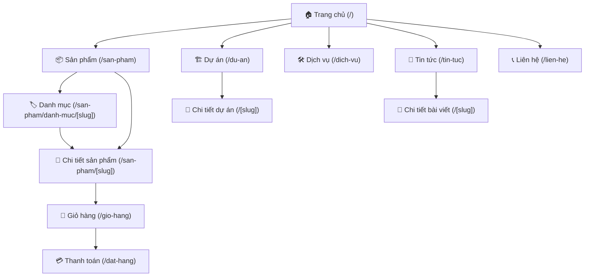
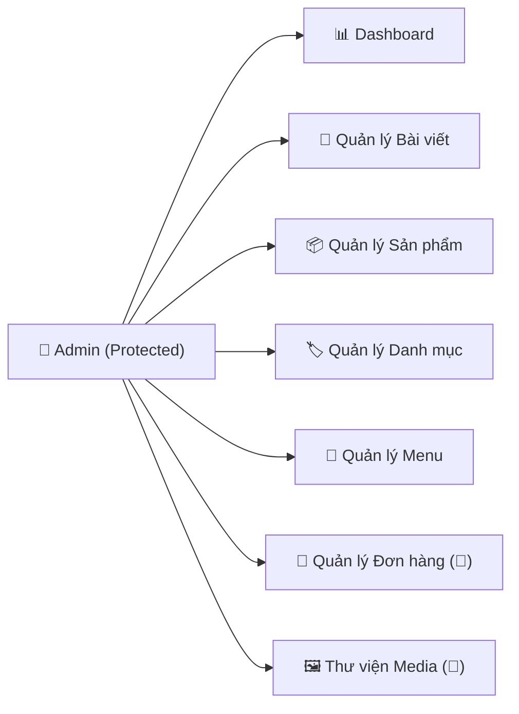
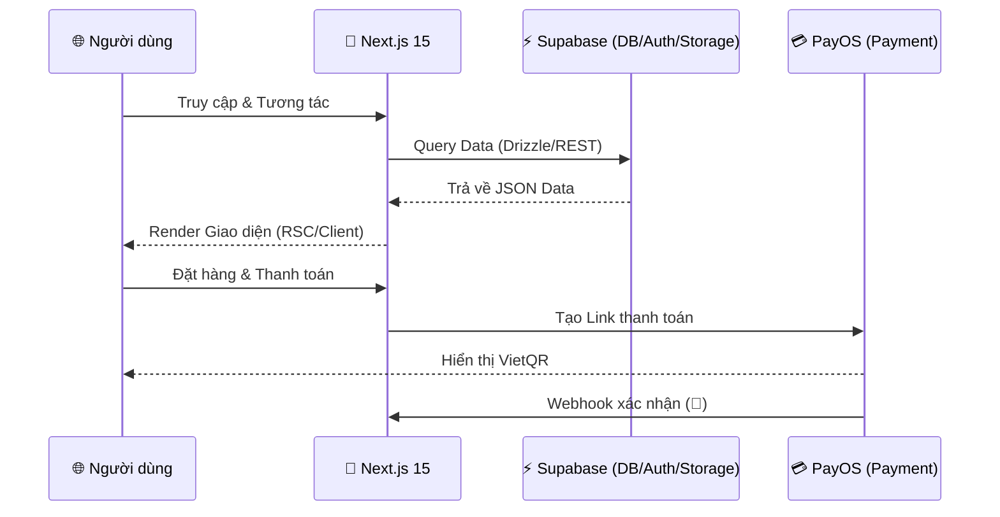

# Siphonet Website - Sitemap & Architecture

Sơ đồ cấu trúc trang web và luồng dữ liệu của hệ thống Siphonet.

## 1. 🗺️ Website Structure (Public)

## 2. 🔐 Admin Dashboard Structure

## 3. 💾 Data Flow & Infrastructure

## 4. 📁 Directory Map

- `/src/app`: Routes & Pages (App Router)
- `/src/components`: UI Components (Shadcn/ui, Layout, Sections)
- `/src/lib`: Logic, Utils, Supabase Client, PayOS config
- `/src/db`: Drizzle Schema & Types
- `/public`: Static Assets (Images, Icons)
- `/scripts`: Seed data & system utilities
